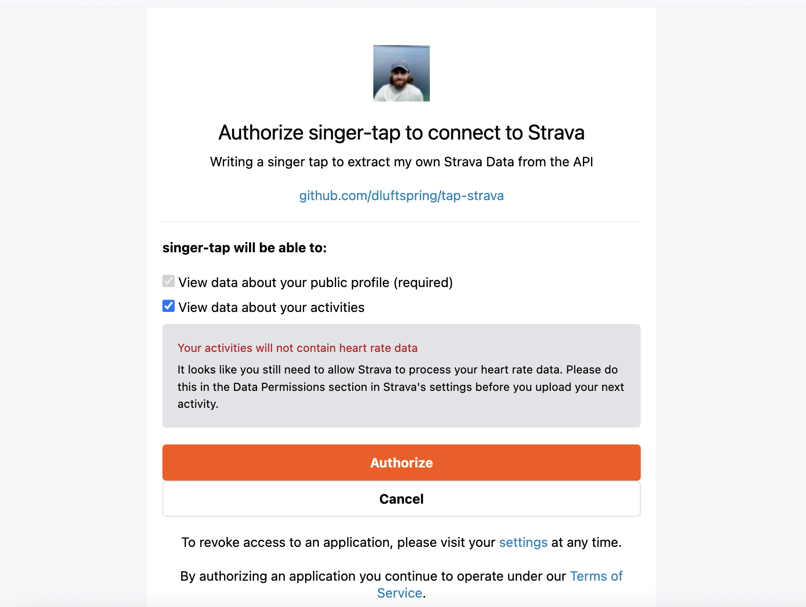

# tap-strava

This is a singer tap for the Strava API built using Meltano's singer_sdk.

## Quickstart

Install poetry for your OS and then run:

```bash
poetry install
```

To run the tap:

```bash
poetry run tap-strava --config <path-to-your-config.json> --test
```

This should validate the tap by trying to sync a single record from the available streams

## Configuration

The tap requires a refresh token, client id, and client secret to be configured. You can get these by following the steps below.

The tap requires a `config.json` file which contains each of your three credentials. Right now the tap only supports a single stream from the `/athlete/activities` endpoint but more will be added in the future.

## Getting a properly scoped refresh token

The Strava API implements Oauth2 which they've documented in detail [here](https://developers.strava.com/docs/authentication/). For the purposes of getting your own data out there is a one time set up process required in order to obtain a properly scoped refresh token so the tap can continue to function. If the tap stops working or you find that the scopes you've requested aren't sufficent to access data you'll have to go through this flow again with the correct scopes.

To make this smoother we'd have to spin up a web server to handle redirect requests and that's not really in scope for this project! If anyone wants to make that happen and pay for the hosting I'd be more than happy to accept a PR. However, I think for the purposes of a data exporting application it's relatively safe to assume that scopes shouldn't change frequently once set.

Before you do any of this I'm assuming you've already created an [app on Strava](https://developers.strava.com/docs/getting-started/#:~:text=If%20you%20have%20not%20already,My%20API%20Application%E2%80%9D%20page%20now.) and have a client id and a client secret available. I'm also assuming you have curl installed on the command line.

### Steps

Open your browser and enter the following URL

```markdown
https://www.strava.com/oauth/authorize?client_id=<YOUR_CLIENT_ID>&response_type=code&redirect_uri=http://localhost&approval_prompt=force&scope=<YOUR_SCOPES>
```

You should be redirected to a Strava authentication modal that looks like:



After you click authorize you should be redirected to an empty page with a URL that looks like:

```markdown
http://localhost/exchange_code?state=&code=<YOUR_ACCESS_CODE>&scope=<YOUR_SCOPES>
```

Copy the access code and then use it to generate your refresh token:

```bash
curl -X POST https://www.strava.com/api/v3/oauth/token \
  -d client_id=<YOUR_CLIENT_ID> \
  -d client_secret=<YOUR_CLIENT_SECRET> \
  -d code=<YOUR_ACCESS_CODE> \
  -d grant_type=authorization_code
```

You'll get a response like

```json
{
    'token_type': 'Bearer',
    'expires_at': 1672268955,
    'expires_in': 21600,
    'refresh_token': 'definitely-a-real-refresh-token',
    'access_token': 'definitely-a-real-access-token',
     .
    .
    .
}
```

Copy the refresh token and use it to configure the tap along with your client id and client secret.